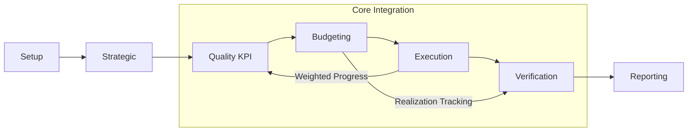
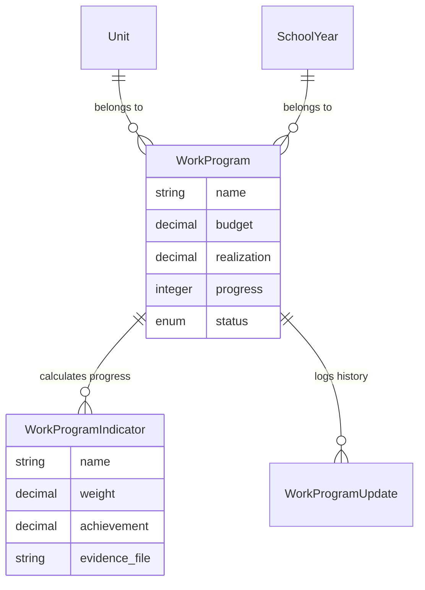

# AIS-Proker: Advanced Monitoring System
> **Professionalized Work Program Management & Weighted Achievement Tracking**

AIS-Proker is a high-integrity monitoring platform built on Laravel 12. It provides organizations with a structured framework to plan, track, and evaluate work programs through an objective weighted indicator system.

---

## 📈 System Workflow

The application operates on an integrated lifecycle, ensuring data consistency from strategic planning to financial realization.



---

## 👤 User Documentation

### Getting Started
1. **Context Selection**: Use the navigation header to select the active **School Year** and **Unit**. All data is scoped to this context.
2. **Dashboard**: Monitor real-time KPIs, including total program completion and budget utilization.

### Module Reference
- **Strategic Plan**: Define the organization's Vision and Mission statements per unit.
- **Quality Targets (KPI)**: Track institutional goals. These targets automatically sync their achievement percentages from related Work Programs.
- **Budgeting**: Manage account codes (COA) and track planned vs. actual spending.
- **Work Programs**: The central execution module.
    - **Indicators**: Break down programs into measurable steps. Assign a weight (%) to each step.
    - **Evidence**: Attach documents or images as proof of completion for every progress update.
- **Reports**: Export comprehensive data to Excel for external auditing.

---

## 👨‍💻 Developer Documentation (GitHub Style)

### Prerequisites
- **PHP**: ^8.2
- **Composer**: ^2.0
- **Database**: MySQL 8.0+ / MariaDB 10.4+
- **Node.js**: ^18.0 (for Vite/Tailwind processing)

### Technical Stack
| Layer | Technology |
| :--- | :--- |
| **Framework** | [Laravel 12+](https://laravel.com) |
| **Frontend** | Blade, Tailwind CSS, Alpine.js |
| **Database** | Eloquent ORM, MySQL |
| **Reporting** | Laravel Excel |
| **Diagrams** | Mermaid.js |

### Architecture Overview

#### 1. Database Schema & Relationships
The core logic resides in the `weightedIndicators` relationship.



#### 2. Weighted Progress Logic
Achievement is calculated on-the-fly via a model accessor in `App\Models\WorkProgram`.

```php
/**
 * Calculate progress based on weighted indicators if they exist.
 * Otherwise, fall back to the manual progress value.
 */
public function getProgressAttribute($value): int
{
    if ($this->weightedIndicators()->exists()) {
        $totalWeight = $this->weightedIndicators->sum('weight');
        if ($totalWeight > 0) {
            $achieved = $this->weightedIndicators->sum(function ($indicator) {
                return ($indicator->achievement * $indicator->weight) / 100;
            });
            return (int) round($achieved);
        }
    }
    return $value;
}
```

#### 3. Global Scoping
To maintain strict multi-tenancy by unit and year, the application utilizes the `HasSchoolYear` trait. This trait automatically applies a global scope to all queries.

```php
// Automatically applied to StrategicPlan, WorkProgram, etc.
protected static function booted()
{
    static::addGlobalScope('school_year', function (Builder $builder) {
        $builder->where('school_year_id', session('school_year_id'));
    });
}
```

### Development Guidelines

#### Installation
```bash
# Clone the repository
git clone <repository-url>

# Install dependencies
composer install
npm install

# Setup environment
cp .env.example .env
php artisan key:generate

# Link storage for evidence files
php artisan storage:link

# Run migrations
php artisan migrate
```

#### Code Standards
- **Naming**: Use CamelCase for classes/methods and snake_case for database columns.
- **Migrations**: Always provide a `down()` method for rollback capability.
- **Commits**: Use conventional commits (e.g., `feat:`, `fix:`, `docs:`).

---

## 📄 Publish & Troubleshooting (Outline.wiki)

Dokumen ini dioptimalkan untuk **Outline.wiki**. Jika diagram tidak muncul setelah import:

### 1. Masalah Teks Saja (Not Rendering)
Jika hanya teks kode yang muncul, pastikan blok kode memiliki bahasa `mermaid` (tanpa huruf kapital). 
- **Tips**: Di editor Outline, coba ketik `/mermaid` di sembarang tempat dalam dokumen untuk memicu library rendering-nya aktif.

### 2. Cara Import yang Benar
1. Buat dokumen baru di Outline.
2. Klik ikon **"..."** (More actions) di pojok kanan atas.
3. Pilih **Import** dan pilih file `.md` ini.
4. Jika masih teks, ubah tipe blok menjadi "Mermaid Diagram" secara manual di editor.

### 3. Syntax Compatibility
Beberapa versi Outline menggunakan Mermaid versi lama. Diagram di atas telah disesuaikan menggunakan `flowchart` dan `erDiagram` standar agar kompatibel.

---
*Last Updated: February 2026*
